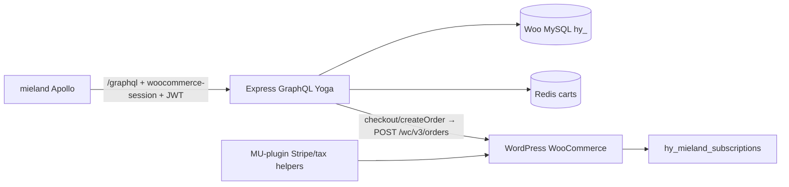

# Node.js WooCommerce GraphQL Commerce API

## Context

This repo is a Dockerized WordPress/WooCommerce headless backend (table prefix `hy_`). The US storefront lives at `[c:\Dev\mieland](c:\Dev\mieland)` (path `../mieland-us` was not present on disk; plan uses `mieland` as the query source of truth). It talks to WPGraphQL/WooGraphQL via Apollo with `woocommerce-session` + JWT.

**Chosen stack (Railway cost):** Express + TypeScript + [GraphQL Yoga](https://the-guild.dev/graphql/yoga-server) + `mysql2` + `ioredis` — low memory vs Nest/Apollo Server.

**Defaults:** Package at [`services/commerce-api`](services/commerce-api); **single GraphQL endpoint** `POST/GET /graphql`; Redis carts; full Mieland pricing parity; order placement via WC REST under the hood.

## Live MySQL schema (Railway `railway` DB, prefix `hy_`)

Introspected against the provided Railway MySQL. Important facts for repositories:

| Fact | Value |
|---|---|
| HPOS | **Enabled** (`woocommerce_custom_orders_table_enabled=yes`); data sync **off** |
| Currency / decimals | USD / 2 |
| Orders read path | `hy_wc_orders` + `hy_wc_orders_meta` + `hy_wc_order_addresses` + `hy_wc_order_operational_data`; line items still in `hy_woocommerce_order_items` / `hy_woocommerce_order_itemmeta` |
| Catalog | `hy_posts` (`product` ×8 publish, `product_variation` ×35) + `hy_postmeta` + `hy_wc_product_meta_lookup` (column `onsale`, not `on_sale`) |
| Coupons | `shop_coupon` ×4 publish |
| Content | `post`, `page`, `lab_results` CPTs present |
| Custom subs | `hy_mieland_subscriptions` + `hy_mieland_subscription_logs` (2 rows; statuses `active,cancelled`; freqs `monthly,every_2_months`) |
| Auth providers | Password **enabled**; Google **enabled**; Facebook/GitHub disabled |
| Shipping (live) | Zones NZ / AU / USA / catch-all “Free Shipping”; methods are **`free_shipping` + `flat_rate` only** (no Amazon MCF method currently in zone tables). Flat rate costs in options e.g. AU `$10`, USA `$1`, catch-all `$50`; free shipping instance 15 requires min `$100` |

**`hy_mieland_subscriptions` columns:** `id`, `user_id`, `status`, `product_id`, `variation_id`, `quantity`, `frequency`, `next_payment_at`, `payment_token_id`, `payment_method`, `parent_order_id`, `last_order_id`, `last_payment_error`, `billing`, `shipping`, `created_at`, `updated_at`, `cancelled_at`. Indexes: PK `id`, `user_id`, `parent_order_id`, `(status, next_payment_at)`.

**Order repository rule:** prefer HPOS tables; do not assume CPT `shop_order` is authoritative (`shop_order_placehold` drafts exist alongside HPOS).

**Shipping engine:** implement flat/free from `hy_woocommerce_shipping_zone*` + `woocommerce_{method}_{instance}_settings` in `hy_options` first; MCF helper only if/when an MCF `method_id` appears in zones.

**Security note:** DB root credentials were shared in chat — rotate the Railway MySQL password after planning if this transcript is retained.

## Architecture




| Concern                                             | Source of truth                                                                                                         |
| --------------------------------------------------- | ----------------------------------------------------------------------------------------------------------------------- |
| Public GraphQL contract                             | Mimic WooGraphQL + Mieland custom fields used by shop                                                                   |
| Catalog / content / coupons / zones / orders (read) | MySQL (`hy_*`)                                                                                                          |
| Cart state                                          | Redis keyed by session token                                                                                            |
| Price / shipping / promo calc                       | Node cart engine                                                                                                        |
| Place order                                         | WC REST API (from `checkout` / `createOrder` resolvers)                                                                 |
| New-order subscription rows                         | **WordPress only** on order place — Node sends `_subscription_frequency` line meta and does not create rows on checkout |
| Existing subscription frequency/qty updates         | **Node** via `updateMielandSubscription` (MySQL write, customer-scoped)                                                 |
| Stripe save-payment / tax helpers / MCF on pay      | Existing PHP (+ thin MU helpers if REST needs them)                                                                     |
| Login / JWT / OAuth                                 | Native in Node — read headless-login options from MySQL; no WPGraphQL proxy; old WP JWTs need not work                  |


## Compatibility target (from mieland)

Highest-signal docs:

- `[c:\Dev\mieland\src\lib\graphql\cart.ts](c:\Dev\mieland\src\lib\graphql\cart.ts)`
- `[c:\Dev\mieland\src\lib\graphql\products.ts](c:\Dev\mieland\src\lib\graphql\products.ts)`
- `[c:\Dev\mieland\src\lib\graphql\customer.ts](c:\Dev\mieland\src\lib\graphql\customer.ts)`
- `[c:\Dev\mieland\src\lib\graphql\subscriptions.ts](c:\Dev\mieland\src\lib\graphql\subscriptions.ts)`
- `[c:\Dev\mieland\src\lib\graphql\posts.ts](c:\Dev\mieland\src\lib\graphql\posts.ts)` / pages / homepage / navigation / lab-results
- Session client: `[c:\Dev\mieland\src\lib\apollo-client.ts](c:\Dev\mieland\src\lib\apollo-client.ts)`

**Session / auth headers (must match):**

- `woocommerce-session: Session <token>` — request + response header; Redis cart id = token
- `Authorization: Bearer <JWT>` — customer/order/subscription identity
- Optional `x-graphql-secret` — if shop proxy expects it, accept/ignore for local

**Do not invent fields.** Implement only types/fields the shop already queries (subset of WooGraphQL + ACF + Mieland subscriptions). Prefer `format: RAW` money args and union types `SimpleProduct` / `VariableProduct` as in shop fragments.

### GraphQL surface to implement (priority)

**Cart / promotions / shipping**

- Queries: `cart` (`GetCart`, `GetItemCount`, `AvailableShippingMethods`)
- Mutations: `addToCart`, `removeItemsFromCart`, `updateItemQuantities`, `updateShippingMethod`, `applyCoupon`, `removeCoupons`
- Types: `Cart`, `CartItem`, `appliedCoupons`, `availableShippingMethods.rates`, `chosenShippingMethods`, `extraData`, totals with `(format: RAW)`
- Lightweight vs full calc: cart line mutations return lightweight totals (no MCF/tax); full shipping/tax on `updateShippingMethod`, full `cart` query when address set, and `checkout` — parity with `[mieland-cart-calc.php](docker/wordpress/src/wp-content/mu-plugins/mieland-cart-calc.php)`

**Checkout / orders**

- Mutations: `checkout` (Stripe meta `_stripe_source_id`, `_stripe_upe_payment_type`), `createOrder`
- Queries: `order(id, idType: DATABASE_ID)`, `customer.orders`
- Order extras used by shop: `amazonMcfTrackingCode` / `amazonMcfTracking` when present in meta

**Products**

- `products` / `products(where: { include, status })` with `ProductCardBase`, attributes, `SimpleProduct`/`VariableProduct` prices `(format: RAW)`, variations for subscription cards

**Customer / auth (native Node — no WPGraphQL proxy)**

- Queries: `customer` (billing/shipping/profile)
- Mutations: `updateCustomer`, `registerCustomer`, `sendPasswordResetEmail`
- Auth mutations matching shop: `login` (PASSWORD + GOOGLE), `refreshToken`, `loginClients`
- Payload shape unchanged for the shop: `authToken`, `refreshToken`, `sessionToken`, `customer` / `user` (+ expirations)
- `sessionToken` = Node Redis cart session (returned on login; shop already prefers it for `woocommerce-session`)

**Respect headless-login settings** by reading `hy_options` (not hardcoding providers):


| Option                                    | Behavior in Node                                                                                                                                                         |
| ----------------------------------------- | ------------------------------------------------------------------------------------------------------------------------------------------------------------------------ |
| `wpgraphql_login_provider_password`       | Enable password `login` only if `isEnabled`; honor `loginOptions`                                                                                                        |
| `wpgraphql_login_provider_google`         | Enable Google only if `isEnabled`; use `clientOptions` (`clientId`, `clientSecret`, `redirectUri`, …) and `loginOptions` (`createUserIfNoneExists`, `linkExistingUsers`) |
| Other `wpgraphql_login_provider_*`        | Expose via `loginClients` only when enabled (shop mainly uses Google)                                                                                                    |
| `wpgraphql_login_settings.jwt_secret_key` | Sign/verify Node JWTs (new tokens; old WP tokens need not verify)                                                                                                        |
| `wpgraphql_login_access_control`          | Enforce authorized origins / custom headers on `/graphql`                                                                                                                |
| `wpgraphql_login_cookies`                 | Honor credentials / cookie-related flags if the shop relies on them                                                                                                      |


Password verify: WordPress-compatible hash check against `hy_users.user_pass`. Refresh: store/rotate per-user refresh secret in usermeta (same idea as headless-login) or Redis. Register: write `hy_users` / usermeta (or WC REST customer create). **No Node SMTP** — `sendPasswordResetEmail` delegates to WordPress (existing WP mail) via a thin WP endpoint/helper; Node does not send email.

**Subscriptions (custom)**

- Queries: `mielandSubscriptionSettings`, `mielandSubscriptions`, `mielandSubscription` (JWT customer scope)
- Mutations:
  - `updateMielandSubscription(input: { id, frequency, quantity })` — **customer updates an existing subscription’s frequency** (and optional quantity); Node writes `hy_mieland_subscriptions`, validates allowed frequencies (`weekly`, `fortnightly`, `monthly`, `every_2_months`, `every_3_months`), requires the row’s `user_id` matches the authenticated customer, recomputes `next_payment_at` from current schedule using the same rules as `[class-subscription-repository.php](docker/wordpress/src/wp-content/mu-plugins/mieland-subscriptions/includes/class-subscription-repository.php)`
  - `cancelMielandSubscription(input: { id })` — customer cancel; Node sets status/`cancelled_at`
- Type `MielandSubscription` fields as in shop fragment (`[subscriptions.ts](c:\Dev\mieland\src\lib\graphql\subscriptions.ts)`)
- Distinct from checkout: creating subscriptions for **new** orders remains WordPress-only; this mutation only updates **existing** rows

**Content (subset)**

- `posts` / post by slug / categories, `pages` / page by uri, homepage ACF, navigation ACF, `labResults` — only fields already selected in mieland gql files (read from `hy_posts` + ACF meta / options)

## Project layout

```
services/commerce-api/
  package.json
  tsconfig.json
  Dockerfile
  railway.toml
  .env.example
  src/
    index.ts                 # Express + Yoga /graphql
    config.ts
    db/mysql.ts
    redis/client.ts
    context.ts               # session token, JWT user, loaders
    schema/
      typeDefs/              # SDL mirroring WooGraphQL subset
      resolvers/
        cart.ts
        products.ts
        checkout.ts
        customer.ts
        subscriptions.ts
        content.ts
        auth.ts
    auth/                    # JWT, password hash, Google OAuth, settings loader
    repositories/...
    engine/{cart,pricing,coupons,shipping,totals}.ts
    clients/woocommerce-rest.ts
    compatibility/           # optional: copy/replay shop operations as tests
```

Also add `[docker/wordpress/src/wp-content/mu-plugins/mieland-rest-checkout-bridge.php](docker/wordpress/src/wp-content/mu-plugins/mieland-rest-checkout-bridge.php)` only for Stripe save-payment / tax-shipping helpers if REST checkout needs them—not for writing subscription rows.

## Cart session (Redis, WooGraphQL-compatible)

- Read `woocommerce-session`; if missing, mint token and set response header `woocommerce-session: Session <token>` (same as WooGraphQL)
- Redis key `cart:{token}`, TTL ~7 days
- Cart JSON: items (`key`, `productId`, `variationId`, `quantity`, `extraData` including `subscription_frequency`), `coupons[]`, customer shipping/billing snapshot, `chosenShippingMethods[]`

`extraData` on add/update must accept WooGraphQL’s JSON string form used by the shop for subscription frequency.

## Cart business engine (full parity)

Unchanged intent; powered by MySQL, exposed only through GraphQL cart fields:

1. Unit price + subscription frequency % from `mieland_subscriptions_discounts` (`[class-pricing.php](docker/wordpress/src/wp-content/mu-plugins/mieland-subscriptions/includes/class-pricing.php)`)
2. Stock checks on add/update
3. Coupons from `shop_coupon` meta
4. Shipping from zone tables + method instance settings in `hy_options` (live: `flat_rate` / `free_shipping`); MCF/tax via WP helpers only if those methods appear or tax is needed
5. Totals: subtotal → discounts → shipping → tax → total; WC decimal rounding (2) — **preview only**; WP reprices on order place

## Checkout: GraphQL in, WC REST out

Resolvers for `checkout` / `createOrder`:

1. Load Redis cart; full totals
2. Build WC REST order payload (line items, coupons, shipping lines, addresses, `payment_method: stripe`, meta including Stripe + `_subscription_frequency` on lines when cart `extraData` has it)
3. `POST /wp-json/wc/v3/orders` with consumer key/secret — **do not** insert/update `hy_mieland_subscriptions` from Node; WordPress subscription capture on order place owns that. **WP/Woo reprices** the order on place (Node cart totals are preview only)
4. Shape response like WooGraphQL (`order { id databaseId orderNumber ... }`, `result`, `redirect`, `customer`)
5. Clear Redis cart on success

Node does not charge cards; shop keeps Stripe client flow + source id meta.

## WordPress bridge (helpers only — no new-order subscription writes)

On REST checkout path as needed:

- **Do not** create Mieland subscriptions when `_subscription_frequency` is present on new orders — that stays in WordPress order-placement / existing `mieland-subscriptions` checkout capture
- Force Stripe save-payment for orders that include subscription line meta (so renewals still get a token)
- Optional `POST /wp-json/mieland/v1/cart-tax` and `.../cart-shipping` for Quaderno/MCF helpers used by the Node engine

Node’s job for subscriptions at checkout: attach line meta correctly so WP can capture after the order exists. Separate GraphQL mutation `updateMielandSubscription` handles frequency changes on existing customer subscriptions in Node.

## Config / Railway

`.env.example`: `PORT`, MySQL (`MYSQL_*`, `MYSQL_TABLE_PREFIX=hy_`), `REDIS_URL`, `WORDPRESS_URL`, `WC_CONSUMER_KEY` / `WC_CONSUMER_SECRET`, `CART_TTL_SECONDS`, `CORS_ORIGIN`. JWT secret comes from `wpgraphql_login_settings` in MySQL (override env only for local). No SMTP env — mail stays on WordPress.

Dockerfile: Node 22 alpine, `node dist/index.js`. Railway: horizontal replicas of the API (stateless) + managed Redis; MySQL shared with WP (pool carefully).

## Production readiness (scale + security)

**Verdict before this section:** the commerce feature plan was not yet production-ready. The items below are now in scope.

### Security (must ship)

- **AuthZ on every sensitive field** — JWT required for `customer`, orders, subscriptions, `updateCustomer`, `updateMielandSubscription`, `cancelMielandSubscription`, and authenticated checkout; never trust client-supplied `customerId` without matching the token
- **Final order money** — WordPress/WooCommerce **reprices on order place** via WC REST; Node cart totals are preview UX only (still computed for shop display). Do not treat Node totals as payment authority
- **Session tokens** — cryptographically random opaque Redis keys; bind cart to customer id on login; TTL + sliding refresh
- **Headless-login access control** — enforce `wpgraphql_login_access_control` origins in production; require `x-graphql-secret` when configured (shop already sends it)
- **GraphQL abuse controls** — disable GraphiQL/introspection in production; max query depth + complexity; reject oversized bodies
- **Rate limits (Redis)** — strict on `login` / `registerCustomer` / `sendPasswordResetEmail` / `checkout`; milder per-IP + per-session on `/graphql`
- **Secrets** — WC keys, JWT secret, Google client secret only via Railway env; never log secrets
- **SQL** — parameterized queries only (`mysql2` placeholders)
- **PII** — redact emails/tokens/passwords in logs; request ids on every log line
- **Checkout idempotency** — Redis idempotency key (header or session+cart hash) to prevent double orders on retries
- **CORS** — allowlist shop origins only; credentials policy aligned with `wpgraphql_login_cookies`

### Scale / reliability (must ship)

- **Stateless API** — all cart/session state in Redis so Railway can run multiple replicas
- **Connection pools** — sized `mysql2` pool per replica; Redis reconnect; fail fast when exhausted
- **Catalog caching** — short-TTL Redis cache for products/options/shipping zones; DataLoaders in context to avoid N+1
- **Cart concurrency** — Redis lock / Lua / `WATCH` on cart mutations so parallel updates do not clobber
- **WC REST bottleneck** — timeouts, limited retries with backoff; do not hold workers unbounded
- **Health** — `GET /health` (liveness) and `GET /ready` (MySQL + Redis) for Railway probes; no secret leakage
- **Graceful shutdown** — drain in-flight requests, close pools
- **Observability** — latency, error rate, checkout success/fail, WC REST latency via stdout
- **Shared MySQL with WP** — short transactions; Node does not long-lock catalog tables

### Not claiming in v1

- Multi-region active-active
- MySQL read replicas (add when metrics show need)
- WPGraphQL Smart Cache object-cache invalidation (APQ handshake only — see below)

## Automatic Persisted Queries (APQ) parity

**In scope.** Match what `[c:\Dev\mieland\src\lib\apollo-client.ts](c:\Dev\mieland\src\lib\apollo-client.ts)` already does with `PersistedQueryLink` (`sha256`, `useGETForHashedQueries: true`):

1. **GET** `/graphql?extensions={"persistedQuery":{"version":1,"sha256Hash":"…"}}` — if hash known, run stored document; if unknown, return Apollo-compatible `PersistedQueryNotFound` (not `PersistedQueryNotSupported`)
2. **POST** with full `query` + same hash in `extensions.persistedQuery` — validate `sha256(query) === hash`, store mapping, execute
3. Persist hash→document in **Redis** (shared across Railway replicas) with generous TTL; optional warm of known shop operation hashes at boot
4. Enforce same depth/complexity limits on persisted docs as on raw queries
5. Do **not** require WP Smart Cache plugin behavior (no object-cache tag invalidation); APQ alone is enough for the shop client to stay efficient

Use GraphQL Yoga’s persisted-operations support or a thin custom plugin implementing the Apollo APQ protocol.

## Implementation order

1. Scaffold Express + Yoga + health/ready + context + security middleware skeleton (CORS, body limit, secure headers)
2. SDL + stub resolvers; run mieland `GetCart` / `GetProducts` documents against it (fail closed on missing fields)
3. Products + content MySQL resolvers + DataLoaders + short-TTL catalog cache
4. Redis cart + cart/coupon/shipping mutations matching `cart.ts` (with cart locks)
5. Native auth + auth rate limits; password + Google `login` / `loginClients` / `refreshToken`; register/update/reset
6. Mieland subscription queries + `updateMielandSubscription` (frequency/qty) + `cancelMielandSubscription`
7. `checkout` / `createOrder` → WC REST + idempotency + response shaping
8. MU-plugin Stripe/tax helpers only (no subscription row creates on new orders)
9. **APQ** (Redis-backed sha256 persisted queries + GET/POST handshake)
10. Production hardening pass (introspection off, complexity limits, rate limits, pools, probes)
11. Smoke: point mieland `GRAPHQL_ENDPOINT` at Node for cart/checkout/auth path (confirm PersistedQueryLink does not fall back to `PersistedQueryNotSupported`)

## Out of scope

- Full WPGraphQL schema dump (only shop-used subset)
- WPGraphQL Smart Cache object-cache / query-tag invalidation (APQ handshake is in scope; Smart Cache plugin parity is not)
- Renewals cron, Algolia, writing catalog from Node
- Creating `hy_mieland_subscriptions` from Node on new checkout orders (WordPress owns that when meta is present)
- Node SMTP / sending password-reset mail from the commerce API (delegate to WordPress mail)
- MySQL least-privilege user setup (use the shared WP DB credentials)
- Backward compatibility with JWTs previously issued by WordPress Headless Login
- Proxying auth mutations to WPGraphQL (except password-reset mail delegation to WP as above)
- Multi-region / read-replica MySQL (defer until metrics show need)

